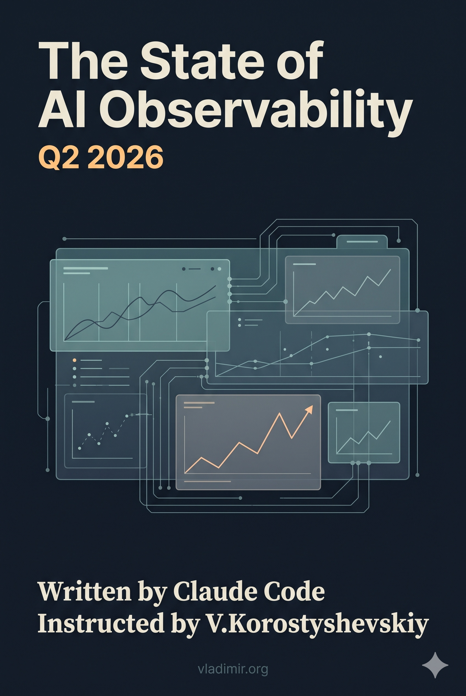

# The State of AI Observability: Q2 2026

A snapshot of production AI observability as it stood in Q2 2026: what the three-pillar model does not see, what breaks when you trace non-deterministic systems, how much it costs, and what happens when the monitoring system is itself an AI. 12 chapters drawn from Datadog documentation, DASH talk recordings, independent cost analyses, incident retrospectives, and OpenTelemetry specifications.

The editorial position is this: the observability gap created by AI workloads is structural rather than configurational, and the tools exist to close it, but the gap between having those tools and using them correctly is still large enough that most teams are discovering it in production rather than at design time.

[Video overview of the project](VIDEO_URL_PLACEHOLDER)

## Why "Q2 2026"

The dateline is not a hedge. It is an analytical tool. The book distinguishes explicitly between claims grounded in mathematical properties and epistemological distinctions that will outlast the current product generation, and claims grounded in specific product versions, billing figures, and competitive capability assessments that will not. Chapter 12 applies what the book calls the Lindy filter to this distinction systematically. Product capabilities change with a release. The epistemological boundary between operational monitoring and evaluation monitoring does not change with a release. The dateline commits to the shelf life. If the field is still active and worth re-surveying in 2027, a second edition will replace this one rather than amend it.

## Why this exists

I wanted to understand the state of AI observability tooling, specifically Datadog's rapidly expanding AI surface, and the principles underneath it that would survive regardless of which vendor's implementation a team chooses. The fastest way to close the gap was not to read every piece of documentation and watch every DASH talk at 1x. It was to build a research corpus and have Claude synthesize it under explicit instructions. I did this for myself, to develop a structured understanding of a field moving faster than any single practitioner can track linearly. After reading what came out, I figured other practitioners might find it useful, and put it here.

## How it was made

I used [YTubeFetch](https://github.com/vkorost/ytubefetch), my own free subtitle download app, to pull subtitles from Datadog's DASH talks and product announcement videos, preserving each video's title, description, and publication date. I used [site2vault](https://github.com/vkorost/site2vault), my own documentation-to-Obsidian converter, to pull down the Datadog documentation site into a structured, searchable local vault with a manifest for section-level reads.

To these I added independently produced research reports synthesized by Claude, Gemini, and Perplexity from public sources: Datadog's competitive positioning, cost analyses, OpenTelemetry GenAI semantic conventions, vector database observability, incident retrospectives, and academic observability research.

The result is a corpus spanning:

| Source | Type | Items |
|--------|------|-------|
| DASH talks (2025-2026) | subtitles | 24 AI-relevant sessions |
| Research reports | markdown/PDF | 15 reports |
| Datadog documentation | site2vault | Full docs site |
| MCP protocol specification | site2vault | Full spec site |

The book itself was assembled with Claude using techniques partially described in [weekend-diy-book](https://github.com/vkorost/weekend-diy-book): style condensation, per-chapter assembly under explicit instructions, dedup, review, edit, revision, and final DOCX/PDF/EPUB generation, orchestrated as a multi-phase pipeline with 18 sequential sub-agents.

## The Five Parts

The book is organized around five parts, each occupying a distinct analytical layer:

- **Part I: The Gap** (Chs 1-2): what AI workloads require that current observability practice does not provide, and the new component classes that generative AI systems introduce as observable entities.
- **Part II: Principles That Survive Tool Generations** (Chs 3-5): cardinality discipline, distributed tracing for non-deterministic systems, and the epistemological separation between operational monitoring and evaluation monitoring. The most durable chapters in the book.
- **Part III: What Went Wrong** (Ch 6): a catalog of documented AI-era production incidents through Q2 2026, organized by failure category with analysis of what monitoring would have caught each one earlier.
- **Part IV: Datadog in 2025 to 2026** (Chs 7-10): Datadog's specific AI surface, instrumentation in practice, cost engineering, and the competitive landscape. The most time-sensitive chapters.
- **Part V: What's Next** (Chs 11-12): autonomous monitoring and the governance problem, and the Lindy filter applied to the book's own contents.

Each chapter introduces one to three named concepts as cognitive handles: **The Cardinality Cliff**, **The Eval/Ops Split**, **The Span Topology Problem**, **The Runaway Cost Loop**, **The Shadow Agent Problem**, **The Lindy Filter**, and others. These are not conclusions; they name the point where the engineering discipline forks and the principled decision must be made.

Chapters are designed to be read sequentially but can be consulted individually. `CONCEPTS.md` collects the named concepts introduced in each chapter.

## What's in this repo

- `README.md`: this file.
- [`book/state-of-ai-observability-2026.pdf`](./book/state-of-ai-observability-2026.pdf): PDF for offline reading and print.
- [`book/state-of-ai-observability-2026.epub`](./book/state-of-ai-observability-2026.epub): EPUB for e-readers.
- `book/chapters/`: the 12 chapters as individual Markdown files, plus the preface.
- `book/CONCEPTS.md`: the named concepts introduced in each chapter.
- `book/BIBLIOGRAPHY.md`: further reading organized by rate of change (stable, medium-cadence, fast-moving).

The raw subtitles, the research reports, the Datadog documentation vault, the assembly pipeline instructions, and the working files (style constraints, registry, reviewer reports) are not published. Only the book and this description are here.

## Coverage cutoff

Documentation, DASH talks, and research reports consulted through Q2 2026 are reflected in the corpus. The field is fluid and products have moved since. Part IV claims are dated with verification tags; Chapter 12's Lindy filter assessment identifies which claims are likely to remain valid and which require re-verification.

## AI assistance, scope of

Claude was used for research synthesis, prose generation in a defined voice (Cal Newport spine, Michael Lopp named-pattern discipline), per-chapter assembly under explicit instructions with anti-repetition registry enforcement, and generating the index. The multi-agent pipeline included a Style Agent, Registry Agent, 12 Writer Agents, Dedup Agent, Registry Compliance Agent, two Reviewer Agents, and an Editor Agent, all running sequentially. Editorial decisions about which positions to include were mine. I did not do any independent fact-checking or source verification beyond what is already in the corpus.

## What's not in scope

This is not a Datadog product guide. It is not a getting-started tutorial. It is not a vendor comparison matrix. It is not a playbook for teams that have not yet shipped an AI-backed system. The reader is assumed to know what a span is, what a token is, and what an agent is.

## Author

I am not employed by Datadog, Anthropic, or any observability vendor. The book was produced independently and does not represent any company's views. The analytical framework, the named patterns, and the structural argument are original to this work. The facts are drawn from the cited public corpus.

## License

Prose is released under [Creative Commons Attribution 4.0 International (CC BY 4.0)](https://creativecommons.org/licenses/by/4.0/). Code samples are released under the [MIT License](https://opensource.org/licenses/MIT). See [LICENSE](./LICENSE) for full terms.

---

